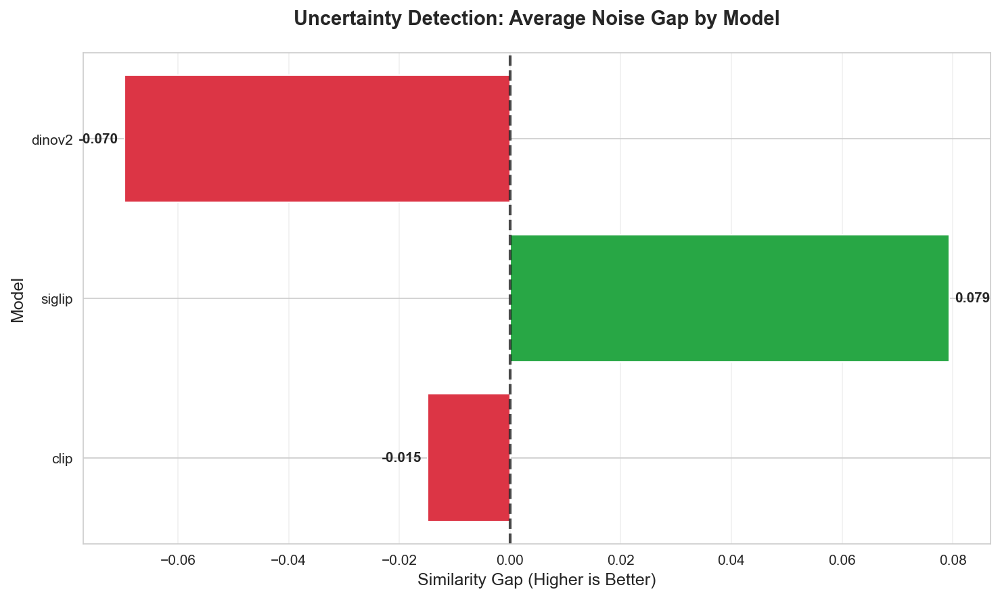

# Caeliai Vision Benchmark

**The first comprehensive evaluation of vision models for fashion intelligence.**

A systematic benchmark comparing CLIP, SigLIP, and DINOv2 on Rick Owens fashion recognition across 12,000+ images. This foundational research explores the capabilities and limitations of current vision models in nuanced aesthetic discrimination tasks.

## Links

- **Website:** [caeliai.com](https://caeliai.com)
- **HuggingFace:** [huggingface.co/kalanpeace](https://huggingface.co/kalanpeace)
- **Repository:** [GitHub](https://github.com/kalanpeace/Caeliai-Genesis-01-Vision-Benchmark)

## Key Findings

**Winner: SigLIP** - Only model with proper uncertainty detection + superior aesthetic understanding.

### Uncertainty Detection


**Critical Finding:** Only SigLIP shows positive noise gap (+0.079), meaning it properly detects when impostor designs don't belong. CLIP and DINOv2 show dangerous overconfidence with negative gaps.

### Aesthetic Cohesion  


**SigLIP dominates** with 63.5% collection purity vs ~48% for CLIP/DINOv2, demonstrating superior understanding of fashion narratives and seasonal moods.

### Processing Performance


**Trade-off:** SigLIP's superior intelligence comes at 9.6x processing cost (30.1s vs 3.1-4.2s), but the accuracy gains demonstrate significant advances in computational understanding of fashion aesthetics.

## What This Tests

**Scale:** 3.66 million image comparisons per model across three core challenges:

1. **Impostor Detection** - Can models spot authentic pieces vs convincing fakes?
2. **Family Recognition** - Do models understand collection cohesion and seasonal narratives? 
3. **Needle Search** - Can models find exact matches in massive databases?

## Usage

**Interactive Demo:**
```bash
python3 fashion_ai_benchmark_ui.py
```

**Technical Report:**
```bash
jupyter notebook vision_benchmark_report.ipynb
```

**Requirements:**
```bash
pip install -r requirements.txt
```

## Results Summary

| Model | Uncertainty Detection | Aesthetic Cohesion | Processing Speed |
|-------|---------------------|-------------------|------------------|
| **SigLIP** | PASS +0.079 gap | 63.5% purity | 30.1s |
| CLIP | FAIL -0.015 gap | 48.8% purity | 3.1s |
| DINOv2 | FAIL -0.070 gap | 48.6% purity | 4.2s |

---

*Part of the Caeliai Genesis research series investigating computer vision approaches to fashion and design understanding.*
